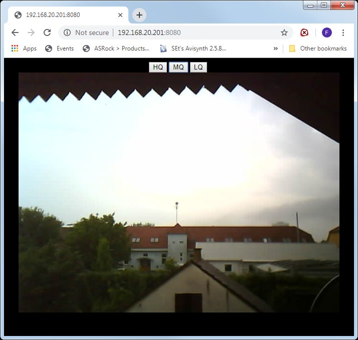

# esp32cam local proxy
Makes it possible to open esp32 cam stream in multiple devices/browsers.
Controll buttons still work global way as there is one camera stream and image resolution set globally.

## Current Functionalities

* hardcoded local ip/port way of reaching camera and this proxy
* multiple connection
* global image size control

## TODO

* Add configurable one place or dynamic render for IP adresses/port, currently hardcoded CAM and proxy URL

# Pictures of the page

## Original esp32cam tutorial page
https://randomnerdtutorials.com/esp32-cam-video-streaming-face-recognition-arduino-ide/

## Where to buy
https://www.banggood.com/Geekcreit-ESP32-CAM-WiFi-bluetooth-Camera-Module-Development-Board-ESP32-With-Camera-Module-OV2640-p-1394679.html
